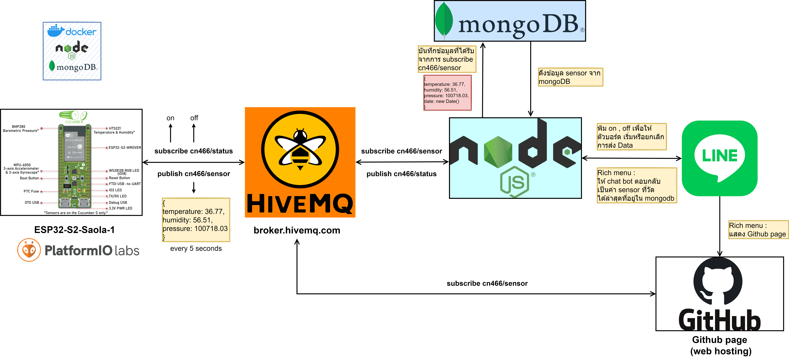

# cn466_MiniProject_1
## แผนผัง

[Youtube -> Explain & Demo](https://www.youtube.com/watch?v=mICHrh44YBc)

---
## ทรัพยากรที่ใช้

- Arduino Board (ESP32-S2-Saola-1)
  - Platform.io Extention
  - MQTT libary
- MQTT
  - Hivemq broker (broker.hivemq.com)
- Docker Compose
  - Nodejs
    - line bot api
    - MQTT libary 
  - MongoDB
- [Github page](https://boykingkao.github.io/cn466miniproject1.github.io/)

---